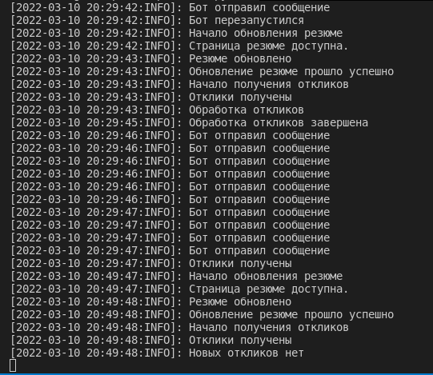
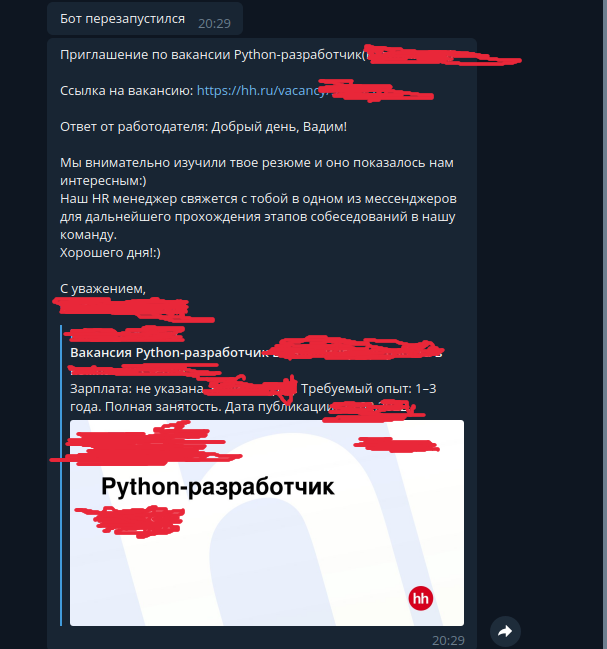

# HH Updater
Telegram bot, который обновляет страницу резюме каждые 20 минут (Heroku засыпает без активности каждые 30 мин), проверяет отклики и, если есть новые отказы или приглашения, шлет в telegram. Также пишет логи и, если есть ошибки, также высылает их в telegram.

## Локальное разворачивание
+ Зарегестрируйте бота в телеграме у @BotFather
+ Внесите в .env данные бота (TELEGRAM_TOKEN, TELEGRAM_CHAT_ID)
+ На странице https://dev.hh.ru/ добавьте новое приложение, а потом зарегистрируйте его.
+ Когда приложение одобрят, сделайте post запрос на
https://hh.ru/oauth/token
  + В теле запроса необходимо передать дополнительные параметры:
    + grant_type=client_credentials
    + client_id и client_secret - необходимо заполнить значениями, выданными при регистрации приложения(https://dev.hh.ru/admin)
  + Поздравляю вы получили токен приложения

+ В браузере перейдите по ссылке: 
https://hh.ru/oauth/authorize?response_type=code&client_id=YOUR_CLIENT_ID
  + YOUR_Client_ID в https://dev.hh.ru/admin
+ Из адресной строки сохраните ?code=SOME_CODE
+ Сделайте post запрос:
 https://hh.ru/oauth/token?grant_type=authorization_code&client_id=YOUR_Client_ID&client_secret=YOUR_Client_Secret&code=SOME_CODE
  + YOUR_Client_ID и YOUR_Client_Secret в https://dev.hh.ru/admin , SOME_CODE мы получили на предыдущем шаге
  + Внесите в .env access_token и refresh_token
+ Сделайте get запрос на ttps://api.hh.ru/resumes/ с полученным access_token и выберите резюме, которое вам нужно и поместите его в .env в RESUME_URL вместо RESUME_ID
+ Теперь из терминала, после установления зависимостей, вы можете запустить бота:
  ```python3 bot.py```

<!-- ## Деплой на Heroku

UPD: Бесплатный Heroku не хранит базу, изменения для него будут внесены по мере возможности.
+ Зарегистрируйтесь на [Heroku](https://www.heroku.com/)
+ Создайте приложение (кнопка New → Create new app)
+ Теперь свяжите ваш аккаунт Heroku c GitHub: в интерфейсе Heroku зайдите в раздел Deploy, в разделе Deployment method выберите GitHub и нажмите на кнопку Connect to GitHub.
+ Добавить переменные окружения нужно вручную в настройках Heroku, в разделе Settings → Config Vars.
Нажмите Reveal Config Vars и добавьте поочерёдно ключ и значение для каждой переменной
+ Перейдите во вкладку Resources и активируйте переключатель напротив строки worker python bot.py -->



